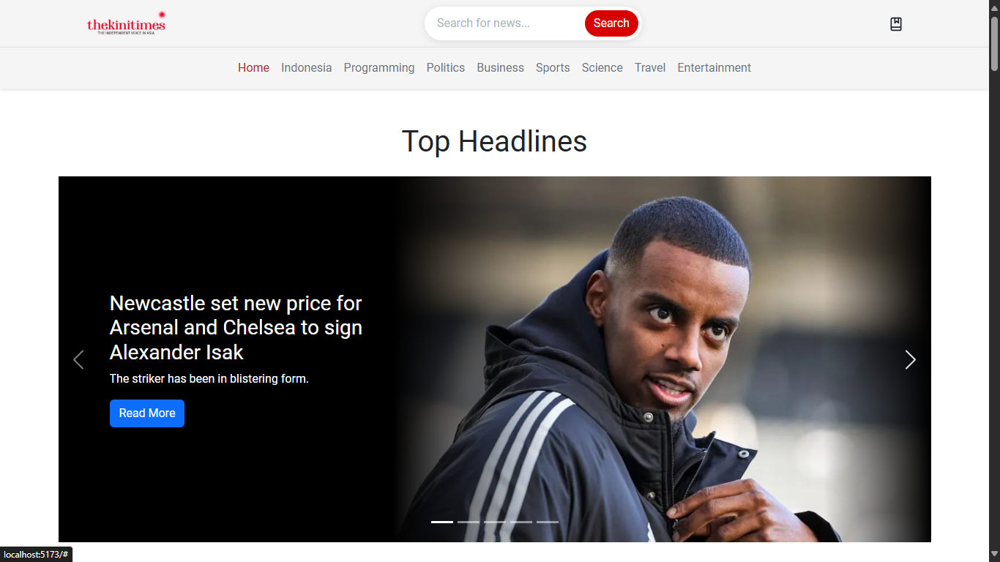

<p align="right">✨ "Stay updated with the world around you!" ✨</p>

<h1 align="center">TheKiniTimes 📰</h1>
<p align="center">
A modern news portal delivering up-to-date and reliable news across various categories, ensuring an intuitive and engaging reading experience.
</p>

## 🖼️ Preview



## 🎯 Project Goal
The goal of this project is to create a user-friendly news platform that provides accurate and timely news updates. The platform focuses on delivering a smooth and engaging user experience with features like category-based filtering, seamless navigation, and a clean UI.

## 🚩 MVP

| Feature                                  | Status |
| ---------------------------------------- | ------ |
| Responsive Design                        | ✅     |
| News Categories                          | ✅     |
| Bootstrap for Styling                    | ✅     |
| Search by Keyword                        | ✅     |
| State Management (Redux)                 | ✅     |

## 💻 Technology Stack

### Core Tech Stack:

- 
- 
- 
- 
- 
- 

### Styling:

- 
- 
- 

### Utility Libraries:

- 
- 

### Development Tools:

- 
- 

## 🌐 Demo Link

Check out the live demo here:

🔗 [TheKiniTimes | Stay Updated with the Latest News!](https://thekinitimes.vercel.app/)

Make sure to use the latest version of your browser for the best experience.

## 📌 Project Structure
```bash
src/
│-- components/   # Reusable UI components
│-- pages/        # Page components
│-- store/        # Redux store & slices
│-- style/        # Style components
│-- assets/       # Static assets (icons, images, etc.)
│-- App.jsx       # Main App component
│__ main.jsx      # Entry point
```

## ⚙️ Installation Guide

Before you start, ensure you have the following installed:

- [Node.js](https://nodejs.org/) (Version 16 or later recommended)
- [npm](https://www.npmjs.com/) or [yarn](https://yarnpkg.com/) package manager

### 1️⃣ Clone the Repository

```bash
git clone https://github.com/adasankin/thekinitimes
cd thekinitimes
```
### 2️⃣ Install Dependencies
```bash
npm install
```
OR
```bash
yarn install
```
### 3️⃣ Run the Development Server
```bash
npm run dev
```
OR
```bash
yarn dev
```

The app will be available at http://localhost:5173/.
